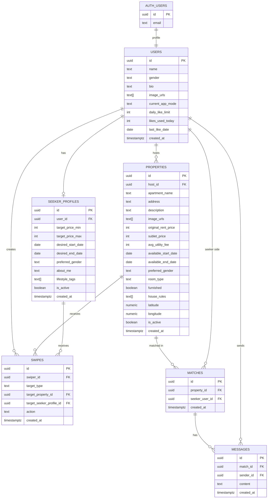

# Roomie ERD

This ERD reflects the current frontend data model and keeps the backend draft mostly intact.

## Frontend-driven updates

- `users.image_urls` was added because the frontend uses multi-image user cards instead of a single profile photo.
- `seeker_profiles.about_me` and `seeker_profiles.lifestyle_tags` were added from the seeker detail modal.
- `properties.room_type`, `properties.furnished`, `properties.house_rules`, `properties.latitude`, and `properties.longitude` were added from the property detail UI.
- `auth.users` remains the source of truth for `email` and `password`; those fields should not be duplicated in `public.users`.
- `owner` in the auth UI maps to `host` in the database/domain model.

## Frontend to DB mapping

| Frontend field | Source | DB mapping |
| --- | --- | --- |
| `User.imageUrls` | `src/data.ts` | `public.users.image_urls` |
| `User.bio` | `src/data.ts` | `public.users.bio` |
| `Property.coordinates.latitude` | `src/data.ts`, `App.tsx` map modal | `public.properties.latitude` |
| `Property.coordinates.longitude` | `src/data.ts`, `App.tsx` map modal | `public.properties.longitude` |
| `Property.roomType` | `src/data.ts`, `App.tsx` property detail | `public.properties.room_type` |
| `Property.furnished` | `src/data.ts`, `App.tsx` property detail | `public.properties.furnished` |
| `Property.rules` | `src/data.ts`, `App.tsx` property detail | `public.properties.house_rules` |
| `SeekerProfile.aboutMe` | `src/data.ts`, `App.tsx` seeker detail | `public.seeker_profiles.about_me` |
| `SeekerProfile.lifestyle` | `src/data.ts`, `App.tsx` seeker detail | `public.seeker_profiles.lifestyle_tags` |
| `email`, `password` | auth screens | `auth.users.email`, `auth.users.encrypted_password` |

## ERD

## Relationship notes

- `users` to `seeker_profiles` is `1:0..1`, because each user can have at most one seeker profile in the current model.
- `users` to `properties` is `1:N`, because one host can list multiple properties.
- `swipes` is polymorphic:
  - when `target_type = 'property'`, `target_property_id` is populated
  - when `target_type = 'seeker'`, `target_seeker_profile_id` is populated
- `matches` connects one property with one seeker user.
- `messages` belong to a single match and are sent by a user participating in that match.

## SQL reference

The reconciled SQL version of this ERD lives in `docs/database/reconciled_schema.sql`.
